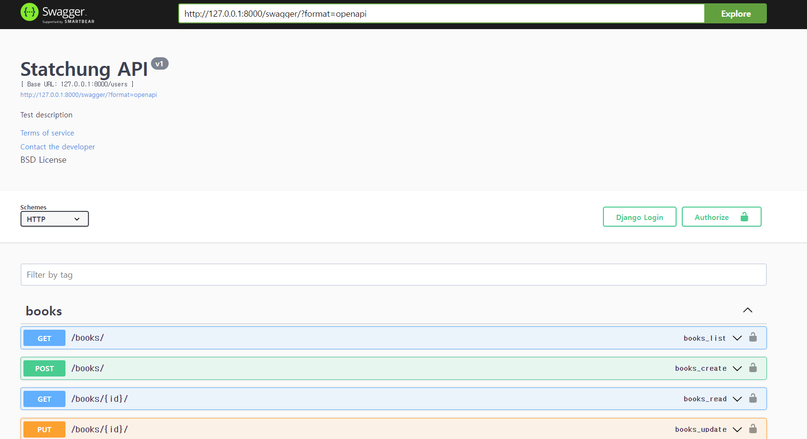

## IMPLEMENT_DRFUser 소개 

 

### 🖐️ 안녕하세요 해당 repository 에 대해 소개드릴 JHeaon 입니다. 

 

해당 리포지토리는 Django Rest Framework 의 User 회원가입/로그인을 구현한 리포지토리 입니다. 

  

### 🎆 사용 방법

 

1. pip install drf_yasg
2. Django add settings users & drf_yasg  
3. To swagger, project_urls.py copy & paste urls.py   

python manage.py runserver로 서버를 열어주시고, /swagger/ 로 이동하시면 밑의 사진 처럼 해당 API을 어떻에 사용하는지에 대한 swagger 페이지가 열리게 됩니다. 

해당 모델중 Profile 모델은 일반적으로 받아오는 User 모델을 확장시키기 위해서 작성한 모델입니다. 해당 모델에 유저 정보에 추가적으로 필요한 것들을 추가해서 관리 하실 수 있습니다. 

 

    

 

